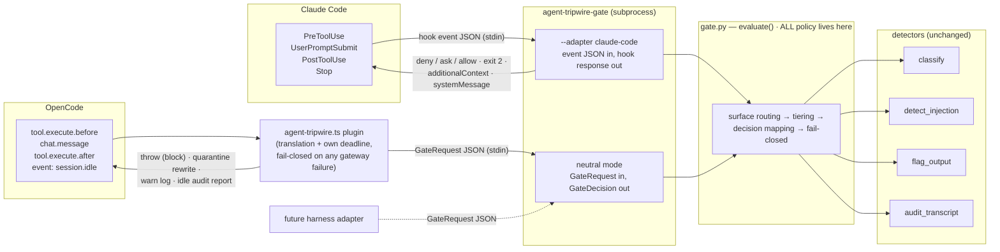
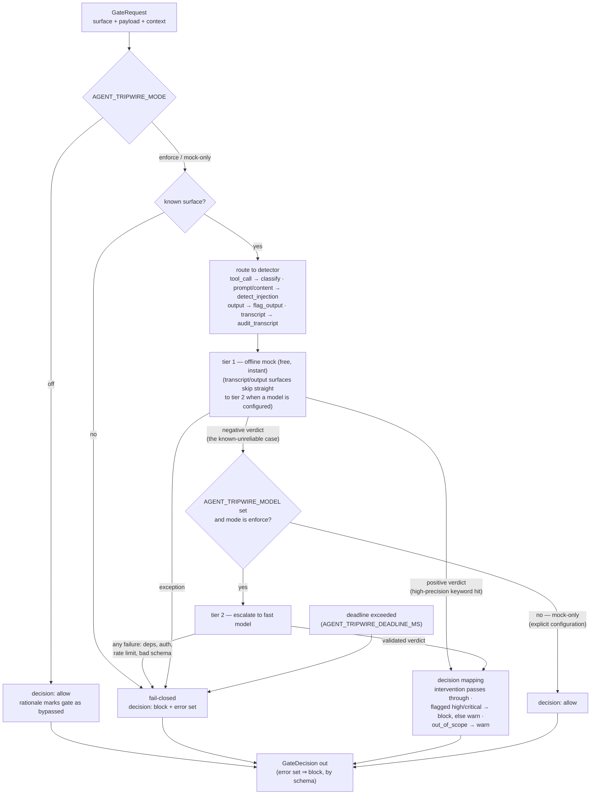

# Design — add-coding-agent-hooks

## Context

The four detectors (`classify`, `audit_transcript`, `detect_injection`, `flag_output`) are
library functions with validated result schemas. Coding-agent harnesses expose hook points
where those verdicts can become *enforcement*: Claude Code hooks (JSON-on-stdin subprocesses
configured in `settings.json`) and OpenCode plugins (in-process TypeScript hooks). This
change adds the enforcement layer.

Hook-API facts this design relies on (researched against current docs/source, 2026-07-13):

**Claude Code** (code.claude.com/docs/en/hooks): `PreToolUse` receives
`{tool_name, tool_input, transcript_path, ...}` on stdin and can emit
`{"hookSpecificOutput": {"hookEventName": "PreToolUse", "permissionDecision":
"allow"|"deny"|"ask", "permissionDecisionReason": ...}}`; `UserPromptSubmit` receives
`{prompt}` and blocks via exit 2 (stderr becomes feedback); `PostToolUse` receives
`{tool_name, tool_input, tool_response}` and can emit `additionalContext` (it cannot
retro-block); `Stop` receives `{transcript_path, stop_hook_active}` and any hook can emit a
user-visible `systemMessage`. The transcript is JSONL whose message lines carry
`tool_use`/`tool_result` content blocks. **Hook timeouts and crashes are fail-open at the
harness level and this is not configurable** (default `command` timeout 600s; per-hook
`timeout` field available).

**OpenCode** (opencode.ai/docs/plugins + `sst/opencode` source, `@opencode-ai/plugin`
v1.17.18): plugins live in `.opencode/plugins/*.ts` (project) or
`~/.config/opencode/plugins/*.ts` (global), export `async ({project, client, $, directory,
worktree}) => Hooks`. `tool.execute.before(input: {tool, sessionID, callID}, output:
{args})` blocks by **throwing** — the tool never runs and the error text is returned to the
model as the tool result; `tool.execute.after(input, output: {title, output, metadata})` can
**mutate `output.output`** (the result text the model will see); `chat.message` receives the
user message parts (a throw aborts the prompt flow — undocumented but verified at the call
site); the `event` hook receives bus events incl. `session.idle {sessionID}` (fire-and-
forget, errors ignored); `client.session.messages({path: {id}})` returns messages with
`tool` parts (`part.tool`, `part.state.input/output/status`) sufficient to reconstruct a
transcript. **`permission.ask` exists in the types but has no call site in current source —
treat as inert.** **OpenCode has no hook timeouts: a hanging before-hook hangs the tool call
indefinitely.** Plugins run under Bun and can spawn processes.

User-set constraints: tiered mock→model escalation (accepted recommendation); **fail-closed
on every internal failure — "a fail-open path is not a security control"**; architecture
must keep future harnesses cheap to add.

## Goals / Non-Goals

**Goals:**

- One harness-agnostic gate: normalized request in → validated decision out, all four
  detectors behind it, tiering and fail-closed logic in exactly one place.
- A stable subprocess protocol (`agent-tripwire-gate`) any harness adapter can speak; the
  two shipped adapters (Claude Code, OpenCode) are thin protocol translators containing no
  policy.
- Enforcement mapped to each harness's strongest available primitive, degrading explicitly
  (and documented) where a primitive is missing.
- Setup instructions good enough to go from a fresh clone to a gated session in minutes.

**Non-Goals:**

- No redaction/rewriting of *user* content; the only content mutation is quarantining a
  tool result the gate blocked (OpenCode `tool.execute.after`).
- No allowlist/policy language (per-tool exemptions, path scopes) — the gate applies the
  detectors uniformly; policy config is future work.
- No daemon/HTTP server; one subprocess per event is fast enough at mock tier and keeps the
  surface auditable. (Revisit if per-call latency ever matters.)
- No harness-side patching: we cannot make Claude Code's own hook timeout fail-closed; we
  minimize and document that residual risk instead.

## Architecture

How the pieces fit — harness hook events flow left to right into the one policy engine,
and enforcement flows back out through the same adapters:



And the decision flow inside one `evaluate()` call — every failure edge lands on the same
fail-closed block, and mock-only allow is a configuration choice, not a fallback:



## Decisions

### D1: A gate engine with two new schemas, `GateRequest` and `GateDecision`

New module `src/agent_tripwire/gate.py`. Schemas follow the house style (closed enums,
`extra="forbid"`, cross-field validators, readable `__str__`):

- `GateRequest`: `surface` (`tool_call` | `prompt` | `content` | `output` | `transcript`),
  `payload` (str or structured; normalized like `_action_text`), `context` (optional dict:
  harness, session id, tool name, stated task — folded into the text the detector sees).
- `GateDecision`: `decision` (reuses `Intervention`: `allow` | `warn` | `block` |
  `confirm`), `rationale` (str), `detector` (which ran), `escalated` (bool), `verdict`
  (the detector's result as a plain dict, present when a detector ran), `error`
  (str | None — set exactly when the decision was produced by the fail-closed path).
  Invariant: `error` set ⇒ `decision=block`.

`evaluate(request, *, model=None, deadline_ms=None) -> GateDecision` is the one public verb.

*Why reuse `Intervention` as the decision enum:* the detectors' intervention vocabulary was
designed as the operator action; inventing a second four-value enum would just need a
mapping table nobody wants to maintain.

### D2: Surface → detector routing and decision mapping

| surface | detector | decision from verdict |
|---|---|---|
| `tool_call` | `classify` | `intervention` passes through |
| `prompt` | `detect_injection` | `intervention` passes through |
| `content` | `detect_injection` | `intervention` passes through |
| `output` | `flag_output` | `clean` → allow; `flagged` → block if severity ≥ high, else warn |
| `transcript` | `audit_transcript` | `in_scope` → allow; `out_of_scope` → warn |

`SensitiveDataFlag` and `TranscriptAudit` carry no intervention field, so their mapping
lives here, in the gate — not bolted onto the detector schemas. `transcript` maps to warn
(never block) because it is retrospective: the actions already ran; the gate's job is to
make the operator look. An unknown `surface` value fails closed (block, error set).

### D3: Tiering — mock positives decide, mock negatives escalate

1. Run the surface's detector on the free, offline mock tier.
2. **Mock positive** (risky / injection_attempt / flagged / out_of_scope): decide from it
   immediately. The mocks' keyword hits are high-precision; no model call needed.
3. **Mock negative**: this is the known-unreliable case (the keyword-blind gap).
   - Escalation model configured → re-run the detector with it and decide from *its*
     verdict. An escalation **failure** (missing extra, auth, rate-limit exhaustion,
     deadline) is an internal failure → **block** with the error as rationale. Fail-closed
     applies to the escalation tier too, per the user's constraint.
   - No model configured (mock-only mode) → allow. Mock-only is an explicit, chosen
     configuration — the operator opted into keyword-level coverage; it is not a failure
     path, so it is not a fail-closed case.

**Exception — retrospective surfaces escalate unconditionally:** for `transcript` and
`output` (the Stop/session-idle surfaces), the mock tier is nearly decorative (pattern
matching over a whole session), and there is no latency pressure at session end. When a
model is configured these surfaces skip the mock-decides shortcut and always use the model,
truncating the transcript from the oldest tool calls (keeping the stated task and the most
recent activity) to fit a bounded payload size. Mock-only installs get the pattern-level
audit and the docs say so plainly.

Configuration:
- `AGENT_TRIPWIRE_MODEL` (any litellm id; a fast small model — Haiku-class — is the
  documented recommendation; unset = mock-only).
- `AGENT_TRIPWIRE_DEADLINE_MS` (default 10000). The deadline bounds the whole `evaluate`
  call; exceeding it is an internal failure → block. The existing litellm path's 180s
  rate-limit budget is therefore effectively capped by the gate's deadline on this path —
  intentional: an interactive hook cannot wait out a rate-limit window.
- `AGENT_TRIPWIRE_MODE` — the sanctioned escape hatch: `enforce` (default), `mock-only`
  (force the mock tier regardless of configured model), `off` (every evaluation returns
  `allow` immediately with a rationale explicitly marking the gate as bypassed). A wrongly
  blocked operator downgrades a session with a visible, reversible env var instead of
  ripping the hooks out of settings — a door with a sign beats a hole in the wall. An
  unrecognized mode value fails closed like any other internal failure.

### D4: `agent-tripwire-gate` — one CLI, a neutral protocol plus built-in adapters

New module `src/agent_tripwire/hook_cli.py`, console script `agent-tripwire-gate`.

- **Neutral mode** (default): one `GateRequest` JSON on stdin → one `GateDecision` JSON on
  stdout, exit 0. This is the protocol future harnesses speak.
- **`--adapter claude-code`**: reads Claude Code's hook event JSON directly (dispatching on
  `hook_event_name`), builds the `GateRequest`, and emits the *Claude-Code-shaped* response
  (see D5). Keeping this translation in Python (inside the package, as
  `adapters/claude_code.py`) means the Claude Code integration is pure configuration — no
  wrapper script to install, version, or drift.
- Exit-code contract: exit 0 whenever a decision was emitted (including block). Any
  failure to even emit a decision exits non-zero with a one-line stderr — and every adapter
  treats a non-zero/unparseable gateway as **block**. There is no input, however malformed,
  that yields silence-plus-success.

The OpenCode adapter stays in TypeScript on the harness side (it must run in-process) and
speaks the neutral protocol via a spawned `agent-tripwire-gate`. Future harnesses choose
whichever shape fits: a new `--adapter` in Python, or an in-harness translator speaking
neutral mode.

### D5: Claude Code adapter — event → surface → response mapping

Configured via a ready-to-paste `hooks` block (project `.claude/settings.json`); all
entries run `agent-tripwire-gate --adapter claude-code`.

**Shipped matcher scope:** the snippet matches `PreToolUse` to high-risk tools only
(`Bash|WebFetch|WebSearch|Write|Edit|NotebookEdit`) and `PostToolUse` to untrusted-content
sources (`Read|WebFetch|Bash|WebSearch`) — gating every `Read`/`Glob` through a subprocess
plus a possible model call is latency the operator never chose. Uniform all-tool gating
remains one matcher edit away and the README shows it; the adapter itself is
matcher-agnostic.

| event | surface | decision → response |
|---|---|---|
| `PreToolUse` (matcher: high-risk tools, see above) | `tool_call` (tool_name + tool_input) | allow→`permissionDecision:allow`; warn→allow + `systemMessage` warning; confirm→`ask` with reason; block→`deny` with reason |
| `UserPromptSubmit` | `prompt` | allow→exit 0; warn→exit 0 + `additionalContext` warning; confirm/block→exit 2, rationale on stderr |
| `PostToolUse` | `content` (tool_response text) | allow→exit 0; warn/confirm/block→`additionalContext` telling Claude the returned content looks like an injection attempt and must not be treated as instructions, plus `systemMessage` for the operator |
| `Stop` | `transcript` + `output` | report-only: parse `transcript_path` JSONL (tool_use/tool_result blocks → transcript; last assistant text → output), emit findings as `systemMessage`; never `decision:block` |

Rationale for the soft spots: `PostToolUse` cannot retro-block, so the strongest honest
control is inoculating the model against the content it already received; `Stop` is
retrospective, and abusing `decision:block` to force the agent to keep working is the wrong
tool for a tripwire — the operator gets a loud report instead.

**Fail-closed wrapper semantics:** the adapter catches *every* internal error and still
emits the blocking response for its event type (deny JSON for PreToolUse, exit 2 for
UserPromptSubmit). Its internal deadline (D3) is set well under the hook `timeout` we ship
in the settings snippet (30s), so the harness's fail-open timeout should never be reached.
**Residual risk, documented in setup instructions:** if the process is killed or the
harness timeout is somehow hit, Claude Code proceeds — harness-level fail-open is not
configurable from outside. This is stated, not silently accepted.

### D6: OpenCode adapter — a dependency-free plugin speaking the neutral protocol

`integrations/opencode/agent-tripwire.ts`, installed by copying (or symlinking) into
`.opencode/plugins/`. No npm dependencies: it uses `@opencode-ai/plugin` types (dev-only),
`Bun.spawn` to run `agent-tripwire-gate`, and its own `AbortSignal.timeout` deadline —
mandatory because **OpenCode never times hooks out**; without our own deadline a gate hang
would hang the whole session, and a deadline hit must resolve to block, not allow.

For parity with the Claude Code matcher scoping (OpenCode has no per-hook matcher config),
the plugin ships a `HIGH_RISK_TOOLS` set for `tool.execute.before` and an untrusted-content
set for `tool.execute.after`; tools outside the sets pass through ungated. Both sets are
plain constants at the top of the plugin file, edited in place to widen coverage.

| hook | surface | decision → enforcement |
|---|---|---|
| `tool.execute.before` | `tool_call` (input.tool + output.args) | allow→return; warn→`client.app.log` warn + return; confirm→**throw** (degrades to block — `permission.ask` is inert in current source, so there is no reliable ask primitive; the thrown reason says the call was blocked pending operator confirmation and how to proceed); block→throw with rationale |
| `chat.message` | `prompt` (message parts text) | allow→return; warn→log; confirm/block→throw (aborts the prompt; surfaces as a session error — verified-but-undocumented behavior, flagged in the plugin README) |
| `tool.execute.after` | `content` (output.output) | allow→return; warn→prepend a `[agent-tripwire]` warning banner to `output.output`; confirm/block→**quarantine**: replace `output.output` with a notice (category + rationale, original length) so injected instructions never reach the model |
| `event: session.idle` | `transcript` (rebuilt via `client.session.messages`, walking `tool` parts) | report-only: findings via `client.app.log` (error hooks here are fire-and-forget, which suits an audit) |

The quarantine rewrite on `tool.execute.after` is the strongest content control either
harness offers — the model never sees the blocked content at all.

### D7: Repository layout

```
src/agent_tripwire/
  gate.py                      # GateRequest/GateDecision + evaluate() — all policy
  hook_cli.py                  # agent-tripwire-gate entry point (neutral protocol)
  adapters/
    __init__.py
    claude_code.py             # event JSON ⇄ GateRequest/response translation only
integrations/
  claude-code/
    README.md                  # setup: install, settings snippet, model config, residual-risk note
    settings.snippet.json      # ready-to-paste hooks block
  opencode/
    README.md                  # setup: copy plugin, model config, caveats (chat.message, no-timeout)
    agent-tripwire.ts          # the plugin
```

Policy (tiering, mapping, fail-closed) lives only in `gate.py`; adapters translate. A third
harness touches `integrations/` and possibly `adapters/`, never `gate.py`.

### D8: Testing strategy

- Gate engine: unit tests for routing, both tiers (escalation seam faked at the existing
  `complete` level), every fail-closed trigger (unknown surface, detector exception,
  escalation failure, deadline exceeded), and the decision-mapping table.
- Gateway CLI: subprocess tests — neutral protocol round-trip, malformed/empty stdin →
  blocking output, exit codes.
- Claude Code adapter: contract tests feeding recorded event payloads (PreToolUse,
  UserPromptSubmit, PostToolUse, Stop with a fixture transcript JSONL) through
  `--adapter claude-code` and asserting the exact response JSON / exit codes, including the
  fail-closed responses.
- OpenCode plugin: TypeScript is typechecked when `bun` is available (skipped otherwise);
  its *protocol* behavior is covered by neutral-mode CLI tests using the exact request
  shapes the plugin sends. A manual smoke checklist ships in its README.

## Risks / Trade-offs

- **[Harness-level fail-open on Claude Code timeout/kill]** → Internal deadline ≪ hook
  timeout so the adapter always answers first; documented as residual risk in setup docs.
  Cannot be eliminated from outside the harness.
- **[Fail-closed + flaky escalation model = blocked workflow]** → Explicitly chosen (user
  constraint). Every blocked decision carries the error in its rationale so the operator
  knows it was an infrastructure block, not a detection; `AGENT_TRIPWIRE_MODE=mock-only|off`
  is the sanctioned, visible, reversible downgrade — designed so a frustrated operator has
  a better option than deleting the hooks.
- **[A documented bypass weakens the control]** → Accepted deliberately: the realistic
  alternative to a designed escape hatch is operators uninstalling the gate entirely after
  the first bad block. `off` is loud (every decision's rationale says bypassed) and
  session-scoped via env, not a persistent config default.
- **[Escalation latency on every mock-negative event]** → Bounded by scoping: the shipped
  Claude Code matchers and the OpenCode tool sets gate high-risk tools and untrusted-content
  sources, not every `Read`/`Glob`; with a Haiku-class model that is ~1–2s on the calls that
  warrant it. Uniform gating stays one config edit away for operators who want it.
- **[`chat.message` blocking is undocumented OpenCode behavior]** → Verified at the current
  call site but could change; the plugin README flags it, and the enforcement that matters
  most (`tool.execute.before` throw) is the documented, canonical mechanism.
- **[Per-event subprocess spawn overhead]** → ~50–150ms for Python startup; acceptable for
  interactive hooks, revisit with a daemon only if it ever isn't.
- **[Double prompting: gate `confirm` + Claude Code's own permission prompt]** → `ask`
  composes with the native permission flow rather than replacing it; worst case the user
  confirms twice, which is annoying but safe-side.

## Open Questions

- None blocking. Per-tool/per-path policy exemptions (e.g. never gate `Read` on the
  project tree) are deliberately deferred until real-use friction shows where they belong.
